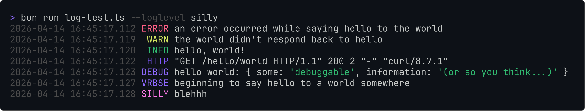

# pretty-simple-logger
a simple logging library that outputs prett-ily. i know, its a terrible pun

this library has two goals:
1. simple logging, with VERY little excess code
2. customization. despite being simple, you have the OPTION to change stuff around.

## how to install:
just like any other js/ts package
```bash
bun install pretty-simple-logger # or with whatever package manager you prefer
```

## example logic:
again, everything is designed to be INCREDIBLY simple. here's how easy it is to start logging stuff:
```ts
import { log } from "pretty-simple-logger";

// boom now you can log stuff

log.error("an error occurred while saying hello to the world");
log.warn("the world didn't respond back to hello");
log.info("hello, world!");

// and some more specific use cases:
//    note: by default these will not be outputted to terminal 
//    UNLESS you add "--loglevel <max log level>"  OR change the configs
//    ex. "--loglevel silly" will show everything

// use middleware don't do this please
log.http(`"GET /hello/world HTTP/1.1" 200 2 "-" "curl/8.7.1"`);

let helloWorld = { some: "debuggable", information: "(or so you think...)" };
log.debug("hello world:", helloWorld);

log.verbose("beginning to say hello to a world somewhere");

log.silly("blehhh");
```
and incase you were curious, this is what the output of that looks like:\


that's pretty much it for the basics! its really, really simple.\
now for some slightly more complicated stuff:

## slightly-more-advanced configuration options
for all the more advanced stuff, it's recommended to use the `Logger` class instead of the default `log`. it works pretty much the same, just create an instance:
```ts
import { Logger } from "pretty-simple-logger";
const log = new Logger();
```
### setting a prefix
supply a string to the `Logger` constructor to add a prefix/identifier, useful for component labeling:
```ts
import { Logger } from "pretty-simple-logger";
const log = new Logger("commands/ping");
log.info("replied with Pong!");
```
output looks like this:\


### other config options
you can tweak various settings through the logger options:
- `levelColors`: customize colors for each level; strongly recommend using the [chalk](https://www.npmjs.com/package/chalk) library for this
- `levelPrefixes`: set custom prefixes for each level
- `logDirectory`: change where logs are saved
- `levelFilenames`: specify filenames for each level
- `alwaysLogToConsole`: specify log levels which should always output, nomatter what `--loglevel` is set to
- `noLevelPadding`: disables the level padding that makes all level prefixes the same length
these can be set when creating a `Logger`:
```ts
const log = new Logger("myComponent", {
  levelColors: { error: chalk.red, warn: chalk.yellow },
  logDirectory: "custom_logs",
});
```
or after creation:
```ts
log.options.logDirectory = "new_logs";
```

the default options can be found [here](https://github.com/ayeuhugyu/pretty-simple-logger/blob/master/src/index.ts#L76)

### using streams
if for whatever reason you need a stream to write to, you can do that too. just use the `getStream("logLevel")` method\
here's a reason why you might want that:
```ts
import express from "express";
import morgan from "morgan";
import { log } from "pretty-simple-logger";

const app = express();

const logstream = log.getStream("http");
app.use(morgan(':id :method :url :response-time', { stream: logstream })); // and now morgan's logging will go to the http log level

app.get('/', function (req, res) {
    res.send('hello, world!')
});
```
alternatively, you can pass any existing `Readable` stream into `log.useStream("logLevel", stream)` and itll do the same thing. getStream just creates a new stream.
## closing remarks or whatever
that's about all i have to say\
\
happy logging or something i guess

uhhh mit license\
small credit where its due, shoutout [reidlab](https://github.com/reidlab) for basically putting me on this in the first place. he made the original small tiny lib file i used to use before i was just like "wait.. this could be An Actual Thing"
